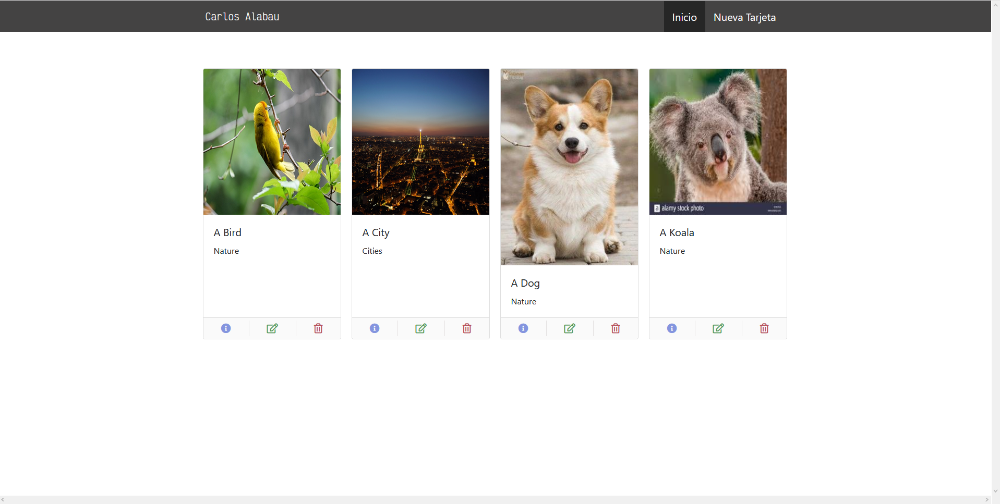

# Prueba_Ossian

Esto es una prueba tecnica para Ossian Technology.
Consiste en obtener unas imagenes de su API, guardarlas en nuestra base de datos y mostrarlas en el front con cualquier framework. Ademas de poder eliminar, ver detalles y actualizar esos datos.
En mi caso he usado Angular para el front y Laravel para el back.

## Requisitos

Es necesario tener NodeJS Y Composer instalado.
Tambien necesitaras algun stack de software, tipo wamp, xamp, etc.. para iniciar el servicio PHP y MYSQL. 

## Instalacion

Necesitas seguir los siguientes pasos:

Empezaremos por el frontend, para ello:
1. Abre la consola, dirigete a la carpeta frontend y ejecuta el comando "npm i" para instalar todas las dependencias.
2. Una vez ha finalizado la instalacion de todas las dependencias, ejecuta el comando "ng serve" para arrancar angular en la direccion 
http://localhost:4200

Para el backend:
1. Dirigete a la carpeta backend y ejecuta el comando "composer update". Recuerda que debes tener instalado composer en el PC.
2. Una vez hecho esto, sobreescribe el archivo ".env.example" a ".env" y modifica el archivo de acuerdo a la configuracion de tu PC. 
3. Dirigete a la carpeta "config/database.php" y modifica el archivo para que cuadre con tu base de datos.
4. Una vez hecho esto, debes ejecutar los siguientes comandos:
    - "php artisan migrate:fresh" (Para migrar las tablas a tu base de datos)
    - "php artisan db:seed" (Para obtener los datos de la API y guardarlos en la base de datos)
    - "php artisan serve" (Para arrancar el servidor)

Si necesitas ejecutar los test, recuerda repetir el paso 4 una vez hayas finalizado para volver a tener todos los datos de nuevo.

## Vista previa

## Autor

Carlos Alabau.